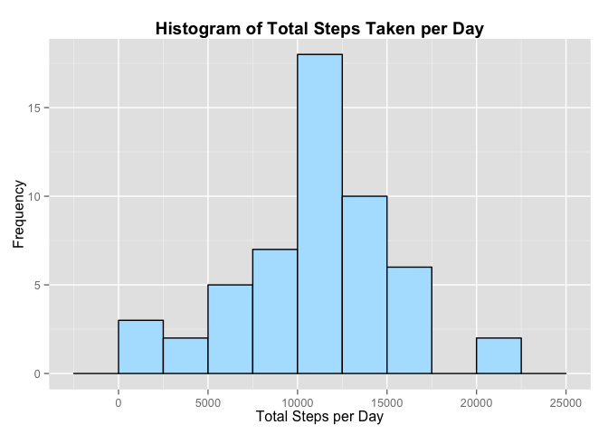
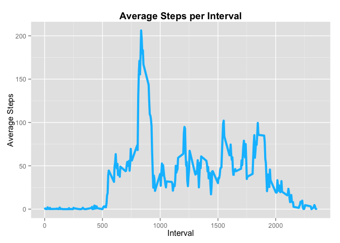
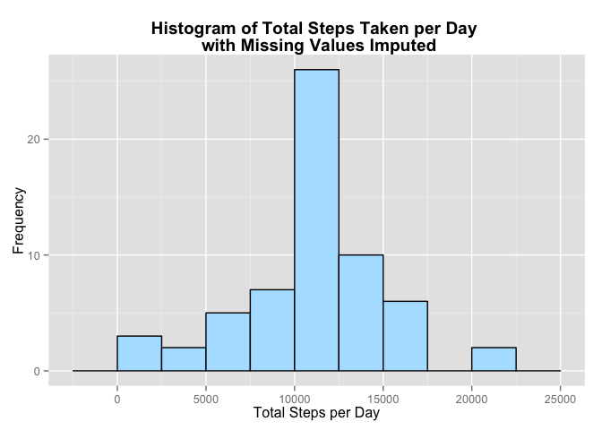
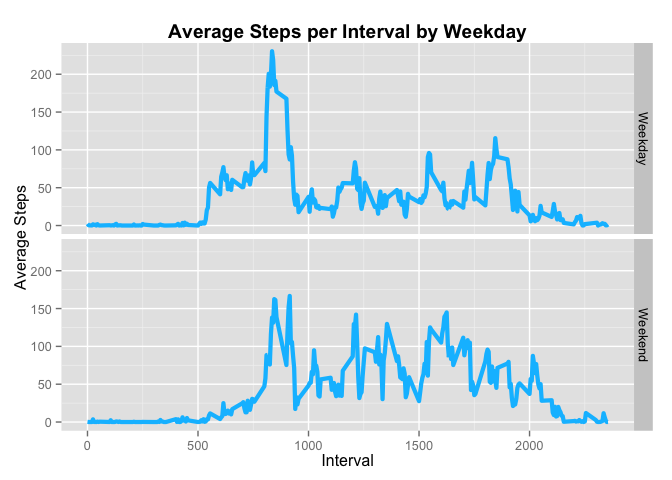

# Reproducible Research: Peer Assessment 1
Tot-oro  
March 15, 2015  

This project makes use of data from a personal activity monitoring device. This device collects data at 5 minute intervals through out the day. The data consists of two months of data from an anonymous individual collected during the months of October and November, 2012 and include the number of steps taken in 5 minute intervals each day. 

## Loading and preprocessing the data
First, let's load the data into RStudio and take a look.


```r
data <- read.csv("activity.csv")
str(data)
```

```
## 'data.frame':	17568 obs. of  3 variables:
##  $ steps   : int  NA NA NA NA NA NA NA NA NA NA ...
##  $ date    : Factor w/ 61 levels "2012-10-01","2012-10-02",..: 1 1 1 1 1 1 1 1 1 1 ...
##  $ interval: int  0 5 10 15 20 25 30 35 40 45 ...
```

```r
head(data)
```

```
##   steps       date interval
## 1    NA 2012-10-01        0
## 2    NA 2012-10-01        5
## 3    NA 2012-10-01       10
## 4    NA 2012-10-01       15
## 5    NA 2012-10-01       20
## 6    NA 2012-10-01       25
```

There are three variables and 17,568 observations in the data. That's 288 observations per day for 61 days. Here are the definitions of the variables.

- **steps**: Number of steps taking in a 5-minute interval (missing values are coded as NA)
- **date**: The date on which the measurement was taken in YYYY-MM-DD format
- **interval**: Identifier for the 5-minute interval in which measurement was taken

Note that **date** is a factor variable in the data, we'll transform it into date format for following analysis.


```r
library(lubridate)
data$date <- as.Date(data$date)
```

## What is mean total number of steps taken per day?
To answer this question, we have to calculate the total number of steps for each day first. And let's take a look at the table we get.


```r
library(dplyr)
daystep <- data %>%
           group_by(date) %>%
           summarize(sumsteps = sum(steps))
head(daystep)
```

```
## Source: local data frame [6 x 2]
## 
##         date sumsteps
## 1 2012-10-01       NA
## 2 2012-10-02      126
## 3 2012-10-03    11352
## 4 2012-10-04    12116
## 5 2012-10-05    13294
## 6 2012-10-06    15420
```

A better way to look at the numbers is to visilize them. We could make a histogram to get a rough idea what the distribution of total steps per day looks like.


```r
library(ggplot2)
qplot(sumsteps, data=daystep, binwidth=2500) + 
        geom_histogram(binwidth=2500, colour="black", fill="lightskyblue1") +
        labs(title="Histogram of Total Steps Taken per Day") +
        labs(x="Total Steps per Day", y="Frequency") +
        theme(plot.title = element_text(lineheight=.8, face="bold")) 
```

 

For more than 15 days, the test individual took 10,000-12,500 steps. And the number of days that fewer or more steps were taken are roughly the same. Now let's calculate the mean and median of the total steps per day to get a better idea.


```r
mean(daystep$sumsteps, na.rm = TRUE)
```

```
## [1] 10766.19
```

```r
median(daystep$sumsteps, na.rm = TRUE)
```

```
## [1] 10765
```

## What is the average daily activity pattern?
We've seen the total steps taken on a daily basis. Another way to look at the data is the average activity pattern, i.e. average steps taken for each 5-minute interval over the entire experiment period.


```r
intstep <- data %>%
           group_by(interval) %>%
           summarize(avgsteps = mean(steps, na.rm = TRUE))
```

Again, we'll make a plot to explore the data.


```r
ggplot(intstep, aes(interval, avgsteps, group=1)) +
        geom_line(size = 1.5, col="deepskyblue1") +
        labs(title = "Average Steps per Interval") +
        labs(x = "Interval", y = "Average Steps") +
        theme(plot.title = element_text(lineheight=.8, face="bold")) 
```

 

From the graph we could see a peek around the 750-1000 intervals. Let's find out which one has the maximum steps taken.


```r
intstep[intstep$avgsteps == max(intstep$avgsteps), ]
```

```
## Source: local data frame [1 x 2]
## 
##   interval avgsteps
## 1      835 206.1698
```

So on average, this person took the most steps in the morning at 8:35 to 8:40 interval.

## Imputing missing values
Note that there are a number of days/intervals where there are missing values (coded as NA). The presence of missing days may introduce bias into some calculations or summaries of the data. Let's find out exactly how many rows have missing values, i.e. **NA**s.


```r
sum(is.na(data$steps))
```

```
## [1] 2304
```

There are 2,304 rows containing missing values, which is about 13% of the data. To deal with the issue, one way is to fill in the missing values with some numbers like mean or median. Here, I decided to use the mean of the 5-minute interval to replace the **NA**s. 


```r
data2 <- merge(data, intstep, by = "interval")
for (i in 1:nrow(data2)) {
        if (is.na(data2$steps[i]) == TRUE) data2$steps[i] <- data2$avgsteps[i]
}
```

Now the missing values are replaced with the corresponding average steps per that interval, let's take a look at the total steps taken per day graph to see if it makes any difference.


```r
daystep2 <- data2 %>%
            group_by(date) %>%
            summarize(sumsteps = sum(steps))
qplot(sumsteps, data=daystep2, binwidth=2500) + 
        geom_histogram(binwidth=2500, colour="black", fill="lightskyblue1") +
        labs(title="Histogram of Total Steps Taken per Day \n with Missing Values Imputed") +
        labs(x="Total Steps per Day", y="Frequency") +
        theme(plot.title = element_text(lineheight=.8, face="bold")) 
```

 

Comparing this graph with the previous one, we could see that the histogram is more centered around the mean after the imputation. What about the mean and median?


```r
mean(daystep2$sumsteps)
```

```
## [1] 10766.19
```

```r
median(daystep2$sumsteps)
```

```
## [1] 10766.19
```

If you go back and check the mean and median of the total steps taken per day before the imputation, the mean after imputation remains the same. However, the median has changed and equals to the mean. 

## Are there differences in activity patterns between weekdays and weekends?
With the missing value issue been taken care of, let's further explore the activity patterns between weekdays and weekends. Before that, we need to know the days of a week for each date. And we'll create another variable indicating whether it's a weekday or a weekend day.


```r
data2 <- mutate(data2, day = weekdays(date, abbreviate = TRUE))         
for (i in 1:nrow(data2)) {
        if (data2$day[i] %in% c("Mon", "Tue", "Wed", "Thu", "Fri")) data2$wday[i] = "Weekday"
        if (data2$day[i] %in% c("Sat", "Sun")) data2$wday[i] = "Weekend"
}
```

Now we'll calculate the average steps for each interval across all weekday days or weekend days.


```r
meanstep2 <- data2 %>%
             group_by(wday, interval) %>%
             summarize(avgsteps = mean(steps))
```

And here comes the plot.


```r
ggplot(meanstep2, aes(interval, avgsteps, group=1)) +
        geom_line(size = 1.5, col="deepskyblue1") +
        facet_grid (wday ~ .) +
        labs(title = "Average Steps per Interval by Weekday") +
        labs(x = "Interval", y = "Average Steps") +
        theme(plot.title = element_text(lineheight=.8, face="bold")) 
```

 

Comparing the above two graphs we could see that, this person took more steps in the morning and less in the afternoon during weekday days, while had more consistent steps through the day during weekend days.
